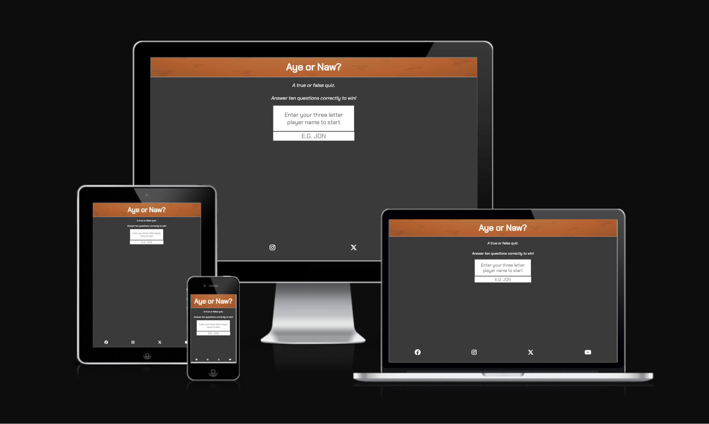
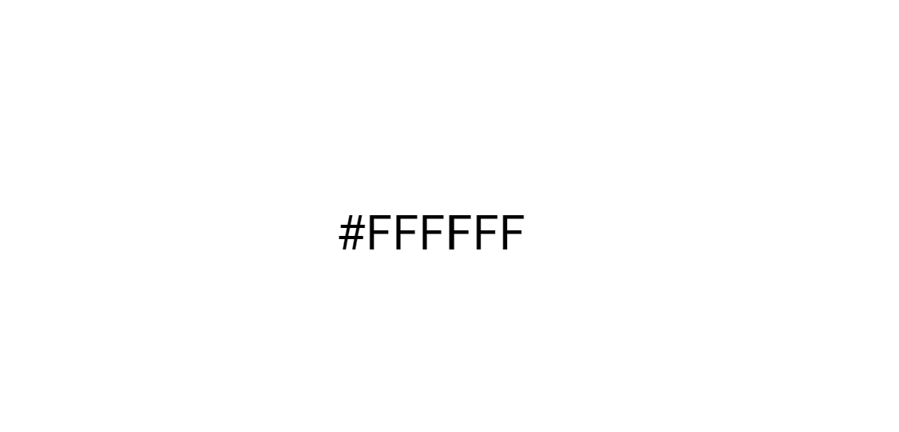
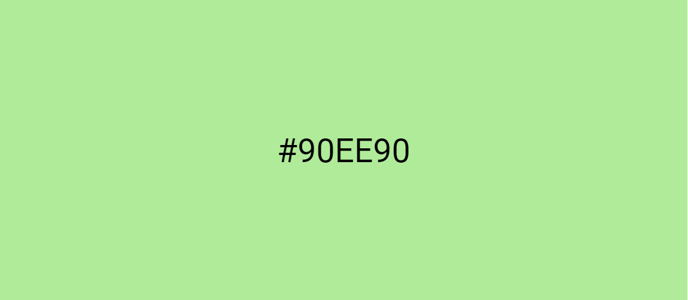
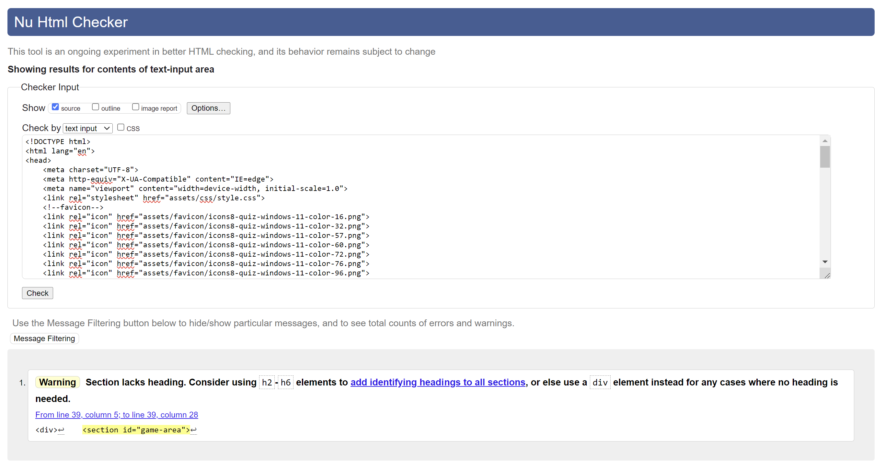
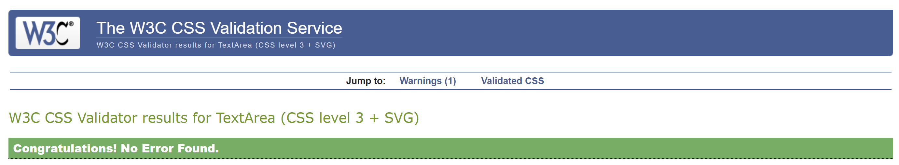
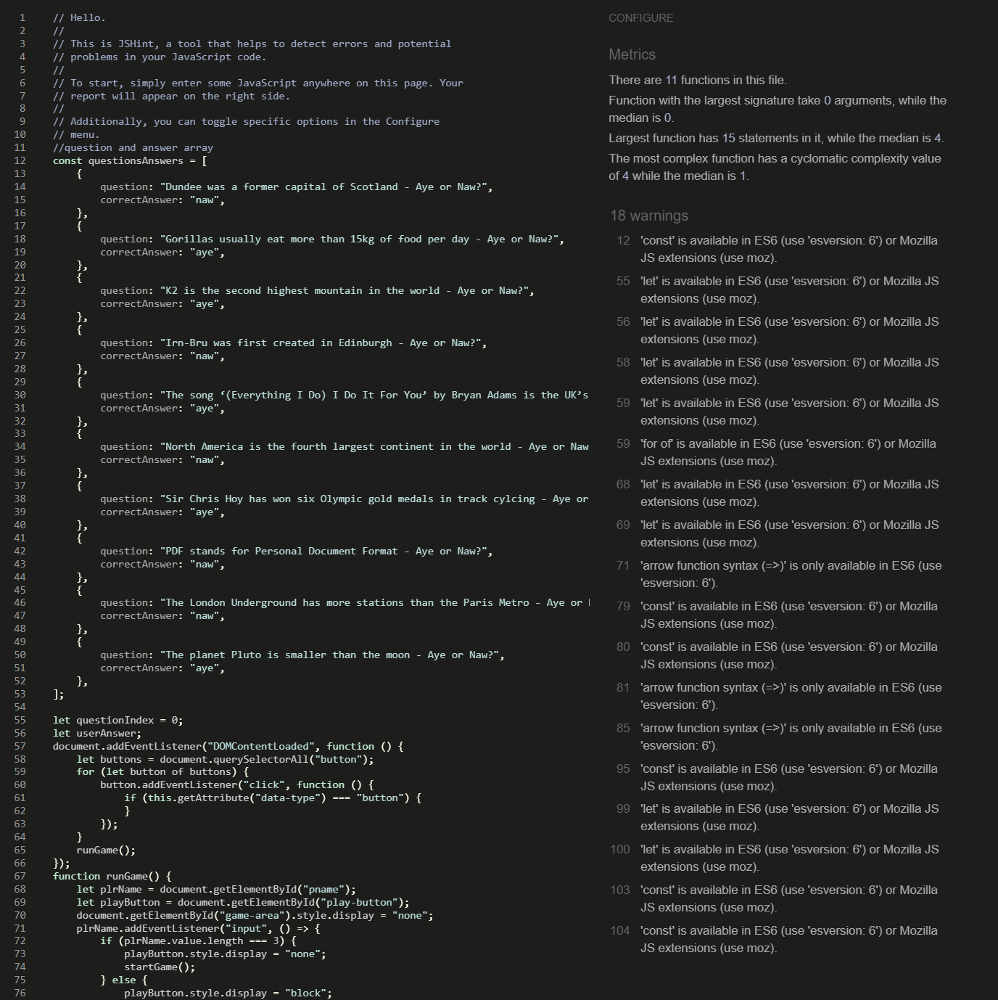
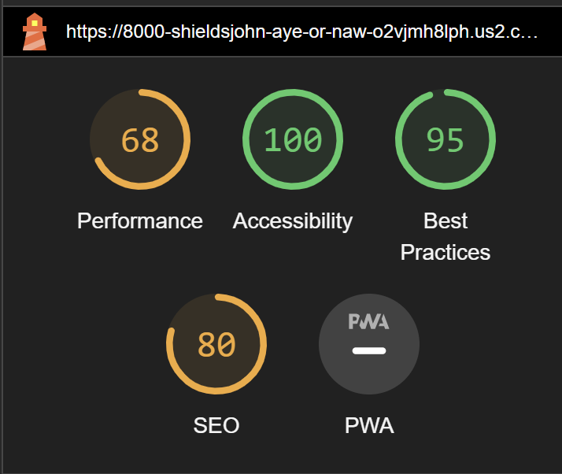
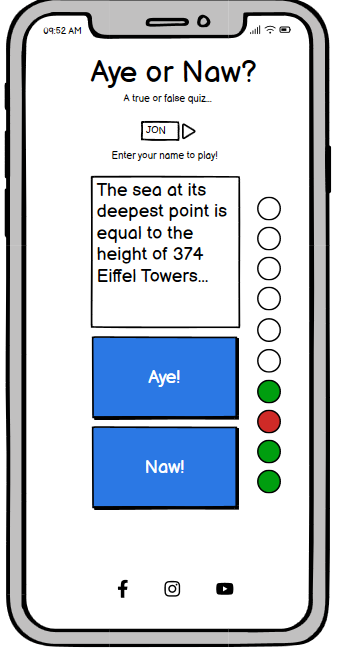

# Aye or Naw?
[Visit the live website here!](https://shieldsjohn.github.io/aye_or_naw/index.html)

'Aye or Naw?' is a true or false general-knowledge quiz, where ten correct answers are required to win.

## User Experience (UX)

### User Stories

o First Time Visitor Goals
- To play a quiz and enjoy playing it
- To intuitively navigate the site and quiz
- To be able to immedidately play again if unsuccessful on first attempt

o Returning Visitor Goals
- To have enjoyed the first visit and to return to try again
- To find new questions in the quiz
- To visit social media sites for the quiz and engage with other fans of the site

o Frequent Visitor Goals
- To beat high scores
- To find new quizzes
- To see development of the site

### Design

o Colour Scheme and Imagery
- With the quiz having a scottish theme, I set the blue and orange of Irn-Bru against a dark grey background, using white text and borders to contrast for accessibility.  I chose vibrant versions of the colours to stand out against the grey and bring energy to the design.
- I also wanted to show correct scores in green and incorrect scores in red.
- Colours used are as follows:

- The orange comes from an image I used in the header, which is as follows:

### Typography

- I have used the font 'Chakra Petch' throughout for it's slightly gaming style, although it is still clean enough for general use.

### Features

- A mobile-first responsive design to allow for most internet traffic being on mobile devices.
- Data validation, to ensure the user enters a three letter player name to start the game.
 - A question box that expands and contracts to fit the length of the questions.
 - Real-time updating of scores for user to see their progress through the quiz.
 - Alerts to communicate if the game is won or lost and the closure of which, restarts the game for the user.
 - Social media links that open in new tabs, to allow the user to stay on the quiz page.

 ## Technologies Used

 - HTML5
 - CSS3
 - JavaScript

 ## Frameworks, Libraries and Programmes Used

o	Google Fonts
-	Used to import the 'Chakra Petch' font, which has been used throughout the site.

o	Font Awesome
-	Used to include the social media icons in the footer.

o	codeanywhere
-	Used as an IDE workspace to code the website.

o	Git
-	Used the Gitpod terminal in codeanywhere to push updates to Github to maintain version control.

o	Github
-	Used as a repository for code of the website.

o	Gitpages
-	Used to deploy the website.

## Code Testing
I used the W3C Markup Validator (for HMTL) the W3C CSS Validator (for CSS) and JSHint (JavaScript) to validate the website's code to ensure there were no syntax errors.  I corrected minor errors by removing unnecessary closing tags in HTML and adding missing semi-colons in JavaScript.  Final validation results below.

*HTML*

*CSS*

## Testing User Stories from User Experience (UX) Section
**First Time Visitor Goals**

o To play a quiz and enjoy playing it
-	The site offers a quick-to-play quiz with challenging questions on a variety of general knowledge subjects.

o To intuitively navigate the site and quiz
- The site has a simple layout, that instructs the user to enter a player name to start the quiz.  Upon starting the quiz, the user is presented with two answer buttons to use until the quiz is finished.

o To be able to immedidately play again if unsuccessful on first attempt
- Upon finishing the quiz, an alert will confirm if the user has won the game or not.  By closing the alert, the quiz is reset for the user to immediately play again.

**Returning Visitor Goals**

o To have enjoyed the first visit and to return to try again
- If the user has enjoyed the quiz and returns to play again, they will find their player name will be selectable in the entry field from the cache and so playing again will be convenient.

o To find new questions in the quiz
- New questions would be added in future site updates.

o To visit social media sites for the quiz and engage with other fans of the site
- The footer provides easy access to the 'Aye or Naw?' social media channels.
- These links open in a new tab, to conveniently allow the user to remain on 'Aye or Naw?'

**Frequent Visitor Goals**

o To beat high scores
- Although the quiz does not store high scores, the user may be inclined to keep returning until they win the quiz.  A stored high score could be a feature in a future update.

o To find new quizzes
- This is something that woud be implemented in future updates to offer the user variety and encourage them to regularly return to the site.

o To see development of the site
- Possibilities for future updates include, a high score feature, multiple quizzes and development of the quiz itself i.e. include picture/video/audio questions.

## Website Testing

-	Responsiveness was tested on Chrome DevTools emulator, my laptop and iPhone 14.
-	Full functionality of the quiz was tested by playing though it to both win and lose.
-	I ran Chrome DevTools Lighthouse to check accessibility, results are below.

## Deployment

o	This website was deployed with Github Pages per the below steps:
-	Log into Github and select the relevant repository.
-	Select ‘Settings’ from the menu along the top of the window.
-	Scroll down and select ‘Pages’ under the ‘Code and Automation’ section.
-	From the dropdown menu under ‘Source’, select ‘Deploy from a branch.’
-	Ensure the dropdown menu under 'Branch’ is set to ‘main’ and the folder dropdown menu next to it is set to '(root)’ and click ‘Save’.
-	The page will refresh.
-	Once refreshed, scroll down and click ‘github-pages’ on the right-hand side.
-	This will take you to the Deployments/History screen where you can click ‘View deployment’ to view the website.

## Credits

o	Code
- All code was written by John Shieds.
- Assistance was provided by my mentor for the iteration of the questions and answers array.
 - I sought assistance from Student Support on the scoring of the quiz.  My original plan was to have ten score elements on the page that either turn green or red, depending on the answer (per the wireframe below).  However, Student Support accepted this was difficult and suggested a different approach.  This is where I changed the scoring to a tally of 'Correct' and 'Incorrect'.

 

 - I also sought out assistance on Stack Overflow for an issue I was having with the alerts appearing before the score for the final question was updated, resulting in nine updated scores then informing the user if they had won or lost.  One of the suggested solutions on Stack Overflow, was to use the setTimeout function to only execute the alerts once the timer had expired.  I found this to the exact solution I was looking for.

 o Content & Media
 - The concept for the quiz was inspired by a quiz of the same name on Greatest Hits Radio Scotland's morning show.  A few questions have been used from that quiz.
 - The image in the header was found using a Google images search as I struggled to find what I was looking for on copywrite-free sites.  The website this originated is https://loft-boarding.co.uk/frequently-asked-questions/

o Acknowledgements
- As mentioned above, support was sought from Code Institute's Student Support and Slack community, my mentor and Stack Overflow.  The support received on this project has been invaluable and has been a great learning experience.